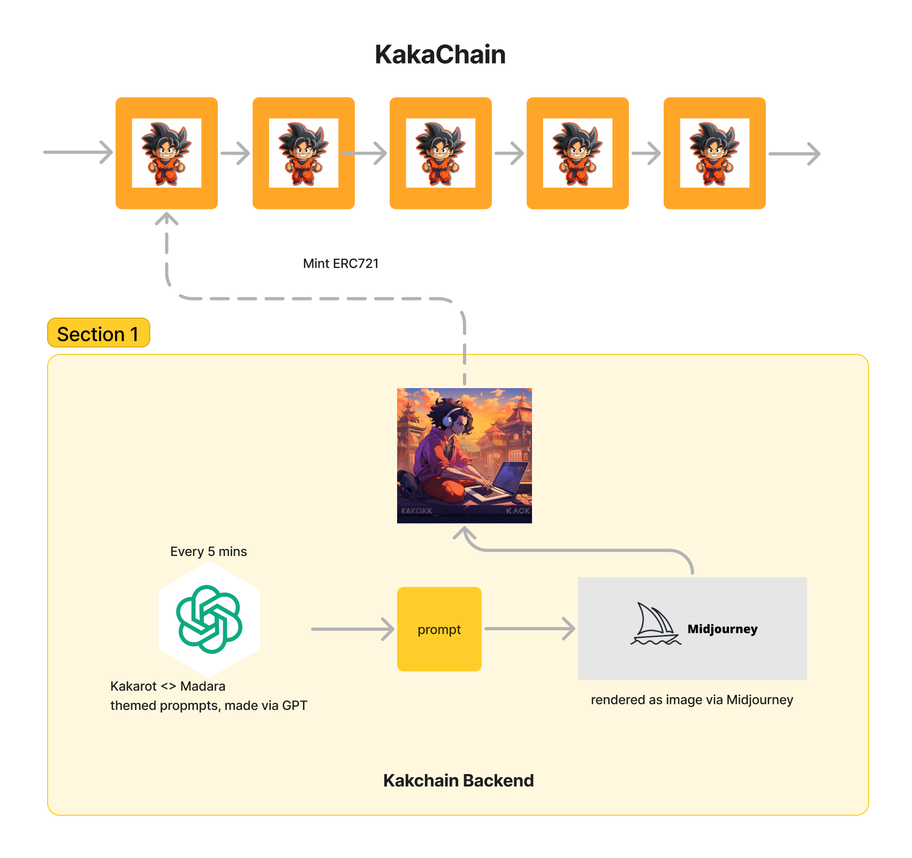
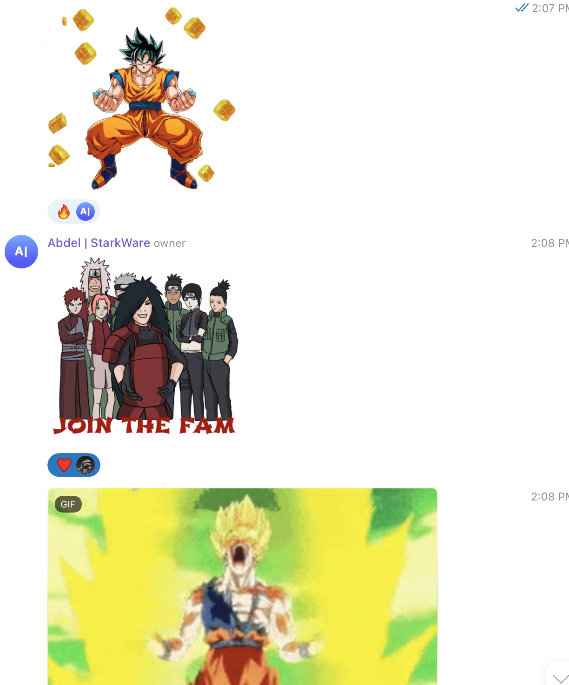

# Kakachain 🥷

Kakachain is a project made during the pragma oracle hackathon.

> It is an independent app-chain launched via Madara. There is only one ERC721 token on the chain, and new mints are produced every 5 minutes by generating Kakarot<> Madara-themed prompts via GPT, rendering them via Midjourney, and then minting them on Kakachain.

- Chain Explorer 🔎: https://kakachain.vercel.app/
- RPC { follows Starknet spec } 📡 http://167.172.70.105:9944:

## Why Kakachain?

Kakachain is a way to explore the modular blockchain stack in a fun way. The idea was to see how fast can new app-chain be launched with frameworks like Madara! **and we were able to launch the chain with the whole project in less than 24 hours!**

Kakarot <> Madara is a fusion that everyone is waiting for, where people will be able to launch a ZK-EVM app-chain.

 

There are memes everywhere about it, and recently there was a lot of interest in using Midjourney to create cool images around this theme.

 
<i>Screenshot of community using cool Kakarot and Madara images/Gif.</i>
 
 

This is where the idea originated, how about we could run a completely automated app-chain, via Madara, where random Kakarot <> Madara-themed NFTs are generated? This would be an interesting way to celebrate this fusion and at the same time a great way to explore an app-chain on Madara.

## Learnings from making Kakachain

Modular blockchains will open up a new world of interesting blockchain applications, I can already see so many more things I can do on this custom app-chain! for example:
- Allow only one erc721 to exist on this chain
- Put a small proof of work requirement for every NFT mint { to make sure I am not being botted }
- change the block production time to match the rate of GPT prompt generation!
- cross chain mint, allow someone to mint on Kakachain by sending a message from other chains, and much more!

I think projects like Madara, Celestia, Avail, etc are going to bring a new wave of interesting interoperable blockchain applications! Let's see 🤞

## Appendix

### You can hack on top of Kakachain!

Yes, because at the end of the day, it is a Starknet sequencer, you can deploy your contracts to it, and use it like any normal Starknet sequencer. Feel free to checkout the Starknet JSON RPC spec to play around!

### How long will Kakachain run?

It has around ~210 prompts, so has enough prompts for 17.5 hours { 1 prompt, every 5 min }! **But there is a secret endpoint by which you can add more prompts! Yes!!!!!**

If you want to add more prompts, reach out to me on Twitter and I can give you the endpoint with the API key!

### Screenshot of explorer 

